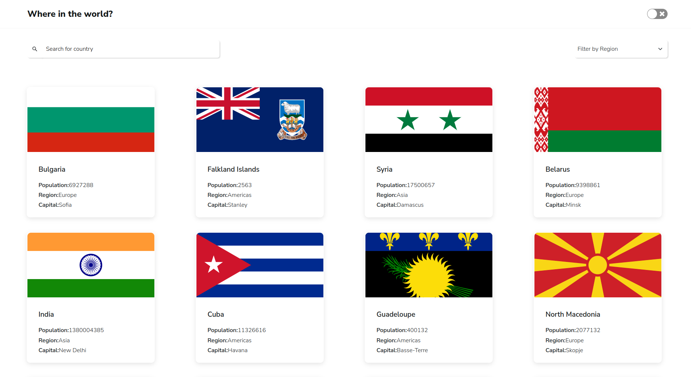
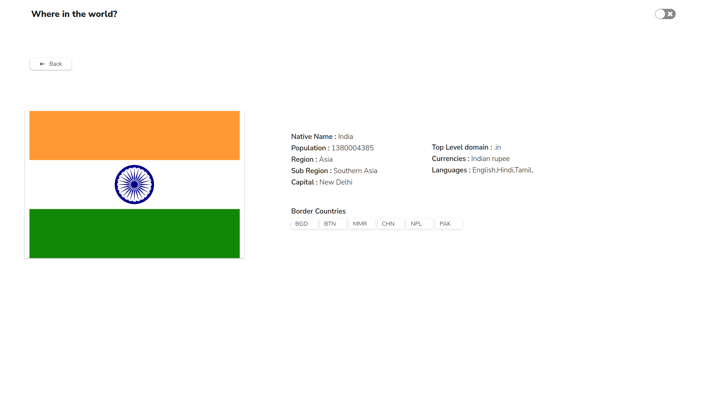
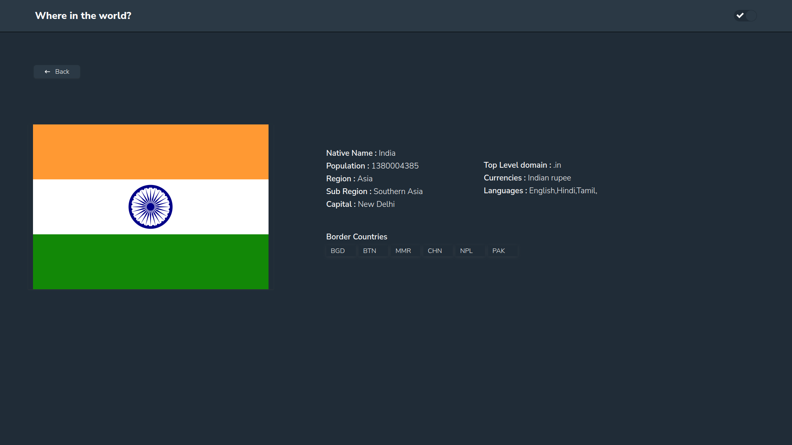

# Where In The World

    Where In The World is a web application powered by React and REST Countries API

## Features

- Dark and Light modes

- Filter by region

- Click on specific countries to learn additional information about them

 

 

 

 

# Tech

- React js
- Lottie-web animation
- REST Countries Api

